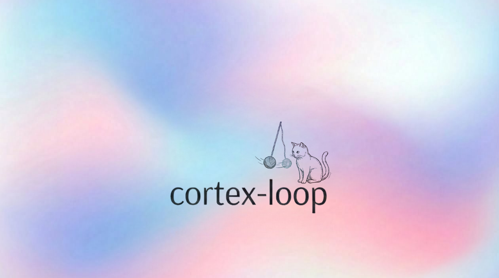

# Cortex

**A quality and judgment layer for AI coding agents.**

Agents lie and follow the path of least resistance. They generate code, skip verification, repeat the same failed approaches, and call it done. Cortex is a pressure layer that sits inside the loop — making it harder to fake the work than to actually do it.

Cortex doesn't replace your agent. It applies pressure exactly where agents tend to cut corners: verification, adversarial test coverage, repeated-failure memory, and foundation risk checks.

---

## See It Work

Real testing outcomes, documented in `docs/evidence/RUN_INDEX.md`:

| Case | Before | After | Evidence |
| --- | --- | --- | --- |
| Frontend discovery quality (top-10 relevance) | 20% (`heuristic_fallback`) | 100% (post-fix rerun) | `docs/evidence/RUN_INDEX.md` |
| Session completion time (production-style workspace) | 11.34m (`heuristic_fallback`) | 5.29m (`ast_pagerank`) | `docs/evidence/RUN_INDEX.md` |

These are testing comparisons from real sessions, not controlled A/B benchmarks. The evidence directory has the full run logs if you want to look closer.

- `START_HERE.md`
- `docs/evidence/RUN_INDEX.md`

---

## What Cortex Actually Does

- **Runs invariant tests the agent didn't write.** If the agent authored the tests, who's testing the agent?
- **Requires adversarial test coverage** across categories: `null_inputs`, `boundary_values`, `error_handling`, `graveyard_regression`.
- **Remembers what failed.** The graveyard records broken approaches and warns before the agent tries the same thing twice.
- **Checks the foundation first.** Runs git churn analysis before major edits so you're not renovating a building with a cracked foundation.
- **Maps the repo.** Generates a `repomap_artifact_v1` so file discovery is fast and grounded, not guesswork.

---

## Current Status: Alpha

Cortex is real, working, and in active development.

| Area | Status |
| --- | --- |
| Hook lifecycle (`SessionStart`, `PreToolUse`, `PostToolUse`, `Stop`) | Working |
| Invariants + challenge gate + requirement audit | Working |
| Graveyard + foundation warnings | Working |
| Repo-map artifact contract | Working |
| Aider graft | Alpha (operational, not parity-complete) |

Parity definition: `docs/REPOMAP_PARITY_CRITERIA.md`

## Compatibility

| Surface | Value |
| --- | --- |
| Package version | `0.1.0` |
| Config schema | `cortex_toml_v1` |
| Repo-map artifact schema | `repomap_artifact_v1` |
| DB schema | `PRAGMA user_version = 1` |
| Supported adapters | `claude` (default), `aider` (alpha) |

---

## Get Started

Requires Python 3.11+.

```bash
pip install -e .
```

For repo-map ranking:

```bash
pip install -e '.[repomap]'
```

### Quickstart

```bash
cortex init --root /path/to/project
cortex check --root /path/to/project
```

`cortex init` sets up everything you need:

- `cortex.toml` — config
- `tests/invariants/` — starter invariant test included
- `.claude/settings.json` and `.claude/CLAUDE.md` — agent integration
- `.cortex/cortex.db` — local state

---

## How It Works

```text
Claude hook event
  → hooks/*.py
  → CortexKernel (core.py)
  → subsystems (foundation, graveyard, challenges, invariants, repomap, store)
  → JSON response
```

On stop, Cortex evaluates challenge coverage, runs invariants, records failed approaches, and returns a structured report. In strict mode, invariant failure sets `recommend_revert=true`.

## CLI

| Command | What it does |
| --- | --- |
| `cortex init` | Bootstrap config, hooks, DB, starter invariants |
| `cortex check` | Validate setup (`--json`, `--write-status`) |
| `cortex fleet status --roots ...` | Check many projects at once |
| `cortex repomap` | Emit repo-map artifact |
| `cortex graveyard` | List failed approaches |
| `cortex show-genome` | Print parsed `cortex.toml` |
| `cortex hook <event>` | Run a hook manually (`--adapter {claude,aider}`) |

### Repo-map Notes

- Default output: `.cortex/artifacts/repomap/latest.json`
- `--json` for pure artifact JSON, `--debug-json` for artifact + debug envelope
- With `[repomap].prefer_ast_graph=true`: method is `ast_pagerank`, backend is `networkx` or `simple`

---

## Security

Invariant execution defaults to host mode. For untrusted repos, use container isolation:

```toml
[invariants]
execution_mode = "container"
container_engine = "docker"
container_image = "python:3.12-slim"
```

Full details: `docs/SECURE_DEFAULTS.md`

---

## Docs

| Doc | What you'll find |
| --- | --- |
| `START_HERE.md` | The fastest path to understanding Cortex |
| `docs/WHY_CORTEX.md` | The problem Cortex solves and why it matters |
| `docs/DEMO.md` | Reproducible demo walkthrough |
| `MISSION.md` | Where this is headed |
| `ARCHITECTURE.md` | How the pieces fit together |
| `todos.md` | Active backlog — see what's next |
| `docs/SHARE_STATUS.md` | Current share status |
| `docs/RELEASE_CHECKLIST.md` | Release gate criteria |
| `CONTRIBUTING.md` | How to get involved |

---

## Verify It Yourself

```bash
pip install -e '.[dev,repomap]'
pytest -q
ruff check cortex tests
cortex check --root .
```

---

## Contributing

Cortex welcomes contributors. Small, test-backed PRs are the way in.

Every behavioral claim should include evidence under `docs/evidence/`. If you say it works, show that it works. That's the standard.

Check `todos.md` for the active backlog and `MISSION.md` for the bigger picture.

---

## A Note on Notifications

This repo doesn't run Dependabot version-update PR automation — your inbox stays clean. Set GitHub watch mode to **Releases only** for updates without noise.
